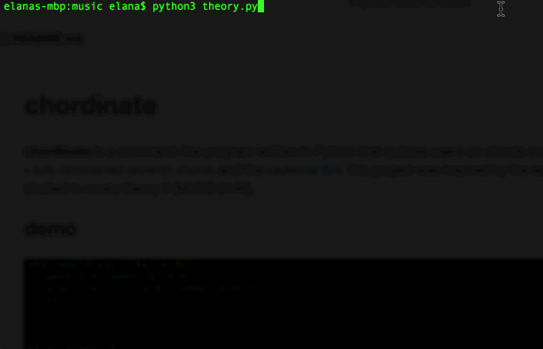

# chordinate
**chordinate** is a command-line program written in Python that generates chords commonly used in classical music - the cadential 6/4 and fully diminished seventh chords. this project was inspired by the several rules for chord resolutions studied in music theory II (MUSC 2146).

## demo

## getKey.py
function to return scale degrees for major and minor keys according to user input

## generateCadential.py
function to generate chord tones for a [cadential 6/4](http://www.harmony.org.uk/book/voice_leading/cadential_6_4.htm), the most common 6/4 chord in tonal music

## fullyDiminishedSevenths.py
functions to generate [fully diminished seventh chords](https://en.wikipedia.org/wiki/Diminished_seventh_chord) (currently only in root position), prompt user to enter notes to resolve viio7 to I chord in SATB style, and check if user input is correct

## chord.py
chord object class

## theory.py
main file

## to do
- document better/more
- function to resolve V7 chords
- add information about fully diminished seventh chords
- ~~function to generate and resolve fully diminished seventh chords~~
- improve generation of seventh chords maybe? i.e. inversions, viio7 as applied chord
- ~~it would be nice if you could spell certain keys enharmonically i.e. either F# or Gb major~~

## things learned/mistakes made/notes to self
- currentKey wasn't cleared before each new key - pitches of each new key were simply appended, resulting in incorrect chord generation
- fully diminished seventh chords in minor were not being built off the leading tone
- parsing strings is difficult when you keep re-capitalizing/enharmonically spelling things
- originially unnecessarily tested if key had sharps in getLeadingTone